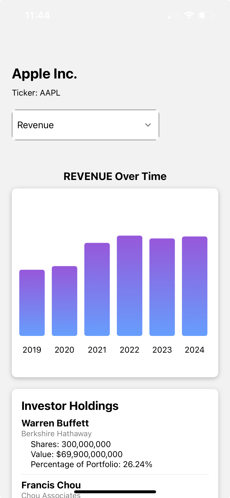
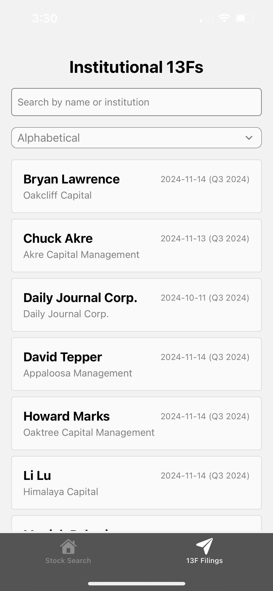

# SEC-Edgar-Visualizer

React Native Application using SEC EDGAR API to visualize data on companies and 13F filings from institutional investors.

Tools and technology Used:
- React Native/TypeScript: To build the apps various components.
- SEC EDGAR API: To get company data and 13F filings from the SEC. 
- SQLite: Local database used to store SEC filings and reduce API calls
- Cheerio: Library used for parsing HTML content from the SEC website.

Demo:
[Watch the Demo Video](https://www.youtube.com/watch?v=cHj9I8wBk9Q)

App Store:
[Google Play Listing](https://play.google.com/store/apps/details?id=com.nathanaelyao.myapp2)

Pictures of App:

  
    
  
  

