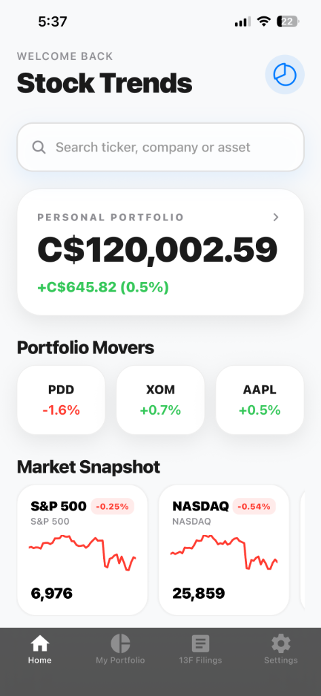
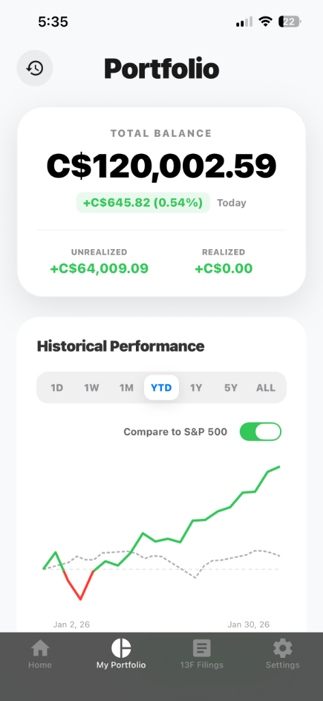
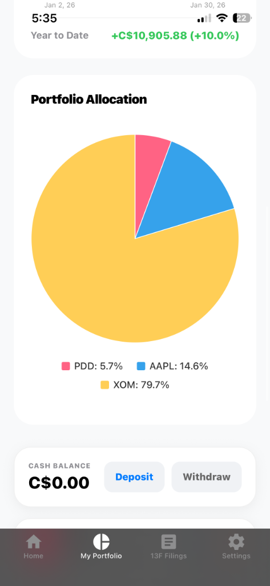
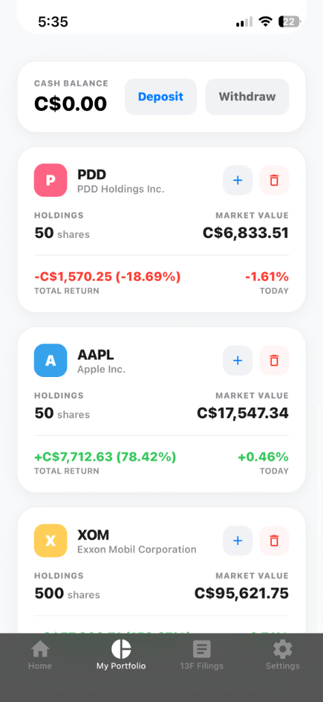
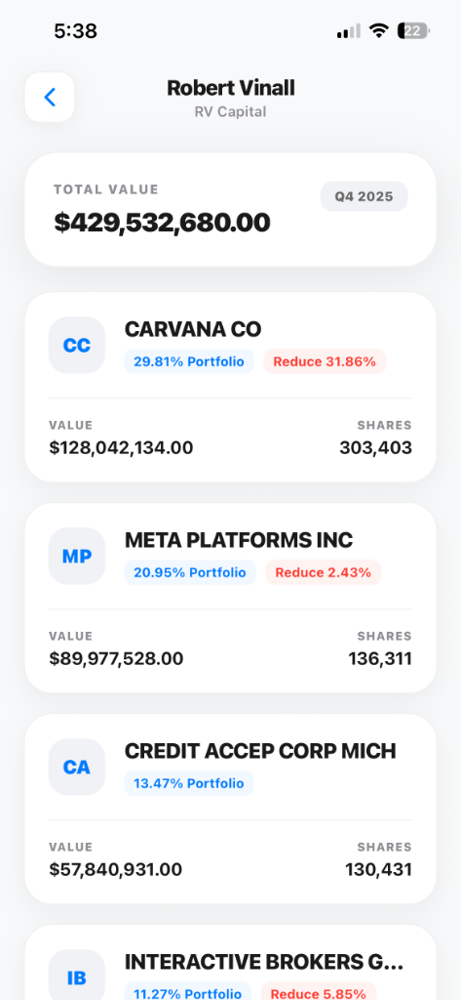
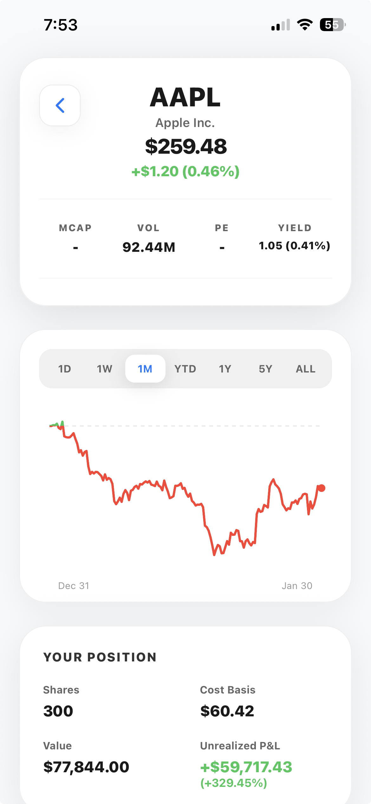
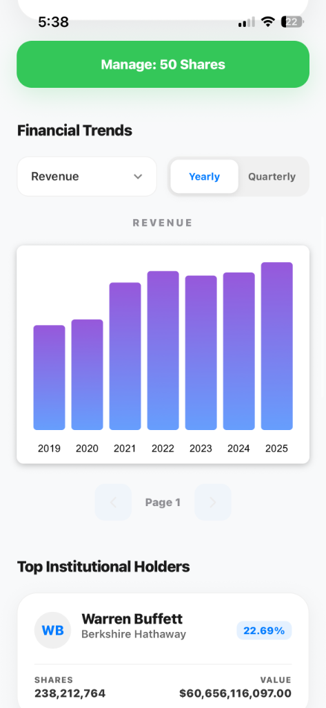
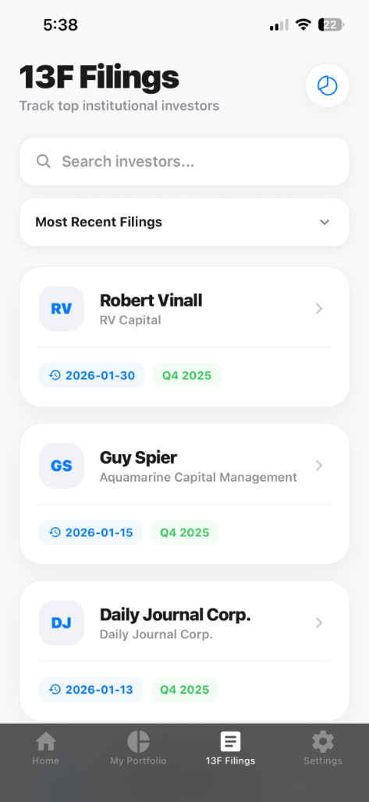
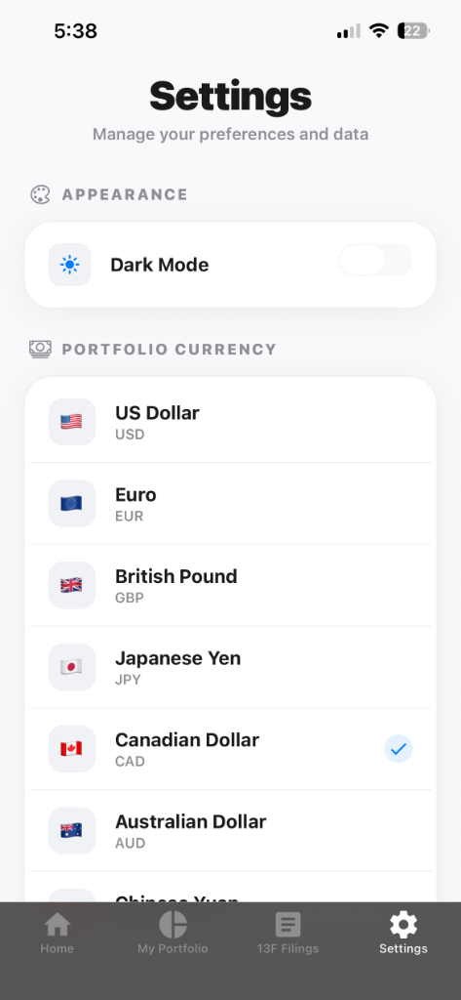

# SEC-Edgar-Visualizer

A financial tracking application built with React Native and Expo. Track your stock portfolio, view SEC 13F filings, and visualize historical performance.

## Features
*   **Portfolio Management**: Track your Holdings, Cost Basis, and Realized/Unrealized Gains.
*   **Real-Time Data**: Fetch current stock prices and historical data.
*   **13F Analysis**: Visualize institutional holdings from SEC Edgar filings.
*   **Touch-Interactive Charts**:
    *   Dynamic Line Charts for Portfolio History.
    *   Bar Charts for Financial Trends (Revenue/Net Income).
    *   Pie Charts for Portfolio Allocation.
*   **Dark Mode Support**

## Tools and technology Used:
- React Native/TypeScript: To build the apps various components.
- SEC EDGAR API: To get company data and 13F filings from the SEC. 
- SQLite: Local database used to store SEC filings and reduce API calls
- Cheerio: Library used for parsing HTML content from the SEC website.

## App Store:
[Google Play Listing](https://play.google.com/store/apps/details?id=com.nathanaelyao.myapp2)

## Screenshots

  
  
  

  
  
   

  
  
  

