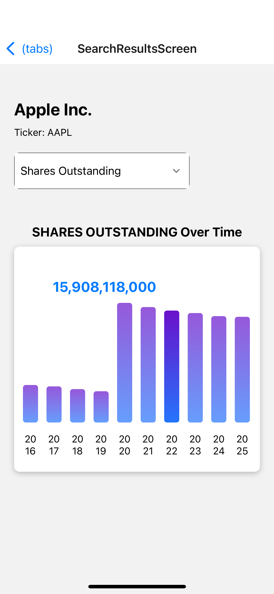

# SEC-Edgar-Visualizer

React Native Application using SEC EDGAR API to visualize data on companies and 13F filings from institutional investors.

Demo:
[Watch the Demo Video](https://www.youtube.com/shorts/RiA2adxvBvw)

Pictures of App:

  
    
  
  

